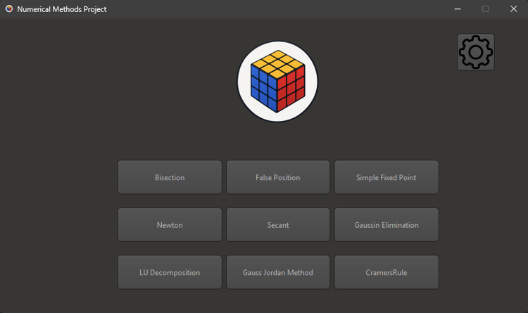
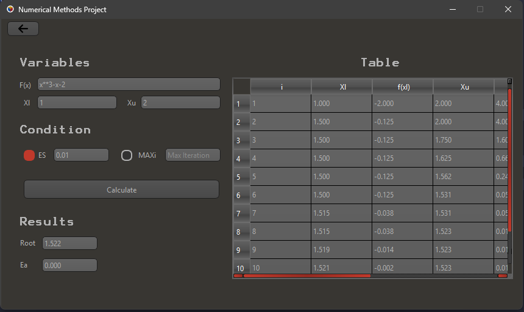
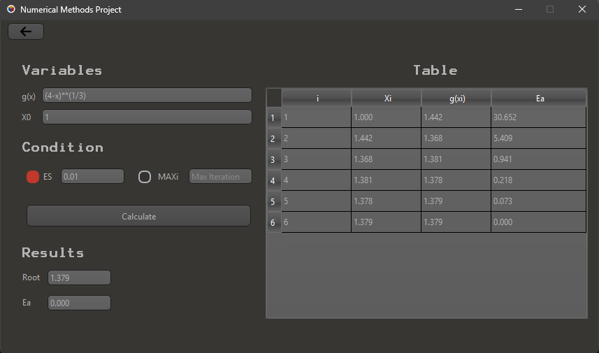
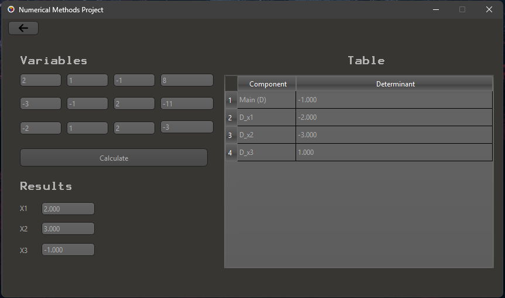

<div align="center">


# Numerical Methods Project

**A PyQt6 desktop application for solving root-finding problems and 3×3 linear systems, with step-by-step iteration tables.**


</div>

---

## Table of Contents

- [Overview](#overview)
- [Screenshots](#screenshots)
- [Features](#features)
- [Supported Methods](#supported-methods)
- [Getting Started](#getting-started)
- [Usage](#usage)
- [Project Structure](#project-structure)
- [Architecture](#architecture)
- [Built With](#built-with)
- [Author](#author)
- [License](#license)

---

## Overview

Numerical Methods Project brings common numerical analysis algorithms into a clean, interactive desktop interface. Enter a function or a system of equations, choose a stopping condition and precision, and the application displays every iteration alongside the final result and error, making it well suited for studying how each method converges.

## Screenshots

<div align="center">



*Main menu: choose any of the nine methods*

<br>



*Bisection: f(x) = x³ − x − 2 on [1, 2], stopping at Es = 0.01*

<br>



*Simple Fixed-Point: g(x) = (4 − x)^(1/3), x₀ = 1, stopping at Es = 0.01*

<br>



*Cramer's Rule: a 3×3 system with determinants D, Dx₁, Dx₂, Dx₃ and the solution*

</div>

## Features

- **Nine classic algorithms** covering root-finding and linear system solving
- **Step-by-step iteration tables** showing how each method progresses
- **Flexible stopping criteria**: target error (**Es**) or maximum iterations (**MAXi**)
- **Configurable precision**: set the number of decimal places (**Round**)
- **Two built-in themes**: Black and Gray, implemented with QSS stylesheets
- **Input validation** with clear error dialogs
- **Tabbed navigation** with a dedicated Settings tab
- **Modular design**: each method's algorithm and UI handler are separate, so new methods are easy to add

## Supported Methods

| Category | Method |
|---|---|
| Root finding | Bisection |
| Root finding | False Position |
| Root finding | Simple Fixed-Point Iteration |
| Root finding | Newton-Raphson |
| Root finding | Secant |
| Linear systems (3×3) | Gaussian Elimination |
| Linear systems (3×3) | LU Decomposition |
| Linear systems (3×3) | Cramer's Rule |
| Linear systems (3×3) | Gauss-Jordan Elimination |

## Getting Started

### Prerequisites

- Python **3.8** or newer
- `pip`

### Installation

1. Clone the repository (or download and extract the ZIP):

   ```bash
   git clone https://github.com/<your-username>/Numerical-Methods-Project.git
   cd Numerical-Methods-Project
   ```

2. Install the dependency:

   ```bash
   pip install PyQt6
   ```

3. Launch the application:

   ```bash
   python main.py
   ```

## Usage

1. Start the app with `python main.py`.
2. Pick a method from the main menu.
3. Enter the function (or system coefficients), initial guesses or bounds, stopping condition, and precision.
4. Click **Calculate** to view the iteration table and the final root and error.
5. Open the **Settings** tab to switch themes or change the rounding precision.
6. Use the back arrow to return to the main menu.

## Project Structure

```text
Numerical Project/
├── README.md                   # Project documentation
├── docs/                       # Logo and screenshots used in this README
│   ├── Logo.png
│   ├── main_menu.png
│   ├── bisection.png
│   ├── simple_fixed_point.png
│   └── cramers_rule.png
│
├── main.py                     # Application entry point
├── Numerical Project.ui        # Qt Designer UI layout
├── validation.py               # Input validation and shared UI helpers
├── Black_Theme.qss             # Black theme stylesheet
├── Gray_Theme.qss              # Gray theme stylesheet
│
├── bisection.py                # Bisection algorithm
├── bisection_handler.py        # Bisection UI handler
├── false_position.py           # False Position algorithm
├── false_position_handler.py   # False Position UI handler
├── fixed_point.py              # Fixed-Point algorithm
├── fixed_point_handler.py      # Fixed-Point UI handler
├── newton.py                   # Newton-Raphson algorithm
├── newton_handler.py           # Newton-Raphson UI handler
├── secant.py                   # Secant algorithm
├── secant_handler.py           # Secant UI handler
│
├── gaussin.py                  # Gaussian Elimination algorithm
├── gaussin_handler.py          # Gaussian Elimination UI handler
├── lu_decomposition.py         # LU Decomposition algorithm
├── lu_handler.py               # LU Decomposition UI handler
├── cramers.py                  # Cramer's Rule algorithm
├── cramers_handler.py          # Cramer's Rule UI handler
├── gauss_jordan.py             # Gauss-Jordan algorithm
├── gauss_jordan_handler.py     # Gauss-Jordan UI handler
│
├── Logo.png                    # Application logo
├── Favicon.png                 # Window icon
├── arrow.png                   # Back arrow icon
├── settings.png                # Settings icon
└── up.png / down.png           # Spinbox arrows
```

## Architecture

The project separates computation from presentation:

- **Algorithm modules** (e.g. `bisection.py`) contain the pure numerical logic with no GUI dependencies.
- **Handler modules** (e.g. `bisection_handler.py`) connect the UI widgets to the matching algorithm, read inputs, and render results.
- **`validation.py`** centralizes input checks and shared helpers used by every handler.
- **`Numerical Project.ui`** defines the layout in Qt Designer, while the `.qss` files control theming.

To add a new method, create an algorithm module and a handler module, then register the handler in `main.py`.

## Built With

- [Python 3](https://www.python.org/)
- [PyQt6](https://www.riverbankcomputing.com/software/pyqt/): GUI framework
- Qt Designer: UI layout
- QSS: theming
- Python `math` module: mathematical functions

## Author

**Ibrahim Hussein Abdel mohsen Ali**: Developer

## License

This project was created for educational purposes. You are free to use and modify it.
